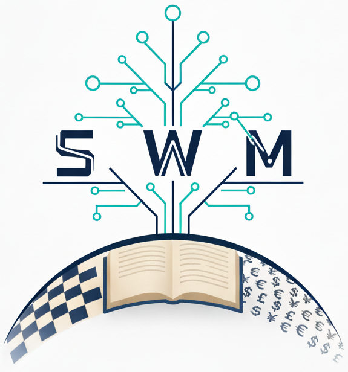

# strategicwm

[](https://github.com/google-deepmind/strategicwm/actions/workflows/pytest_and_autopublish.yml)
[](https://badge.fury.io/py/strategicwm)

## Overview



> The name `strategicwm` (or `swm` for short) stands for *strategic world
models*.

`swm` uses LLMs to aids users in automating the construction of formal
**strategic world models**, e.g., game trees, simply from natural language
descriptions. Utilities are provided for **visualizing** and performing
**game-theoretic analysis** of these multi-agent interactions.

**a**) `swm` currently offers two approaches to building strategic world models,
the first of which takes a *multi-agent* approach to game tree construction
itself. This is demonstrated in the `colabs/cultivate` notebook.

Extensive-form games are typically defined as a list or tuple of critical
components:

- A set of players (including a chance / nature player),
- A mapping from world state to player identity (whose turn it is),
- A mapping from information state to the set of actions available to a player,
- A mapping for each player from states to information sets (what information
  is available to each player in a given state),
- A mapping from state to a binary outcome indicating a terminal node (leaf)
  has been reached,
- A mapping from terminal nodes (leaves) to payoffs for each player.

`swm` defines a specialized agent to execute each of these functionalities.
Analogously to how the software development cycle has been decomposed into an
assembly line of various role-specific agents executing bespoke tasks, `swm`
decomposes the rigorous modeling of an extensive-form game into the
coordination of the above set of specialized agents.

`swm` models the root node as a *chance node* which generates all the possible
initial world states the scenario might describe. LLM generation is stochastic
in general, so their responses are also modeled as chance nodes. The user can
control the number of stochastic responses considered with the `num_llm_seeds`
parameter.

Each expansion of a node in the game tree might require the coordination of
multiple agents and hence require multiple LLM calls (~3). For this reason,
`swm` also offers a second approach that potentially trades accuracy for faster
speed and lower cost.

**b**) The second approach generates a full json tree from a single LLM call,
which will likely be much cheaper in terms of token cost and also much faster to
generate trees. The downside is sometimes a less comprehensive model of the
interaction and fewer options to easily edit / re-generate subtrees. This is
demonstrated in the `colabs/transplant` notebook.

### What is `strategicwm` for?

The overarching goal of `swm` is to provide an API between the multi-agent
interactions that exist in everyday life and the wealth of abstract, academic
research on this topic in fields like computational game theory. With such a
bridge, we hope learn how to make better decisions in real-world scenarios, and,
as a byproduct, improve our abstractions and research in game theory.

* **Game Construction:** `swm` is designed to quickly prototype small game
trees based on user descriptions of arbitrary scenarios.
* **Game Solving:** `swm` provides utils for loading user constructed game
trees into [OpenSpiel](https://github.com/google-deepmind/open_spiel) for
game-theoretic analysis.
* **Research:** `swm` implements accelerated equilibrium solvers for
 n-player general-sum games, which can also serve as baselines for game-theory
 research in equilibrium solving and selection.

## Installation

You can install `strategicwm` from PyPi:

```bash
pip install -U strategicwm
```

or from source, with no stability guarantees.

```bash
pip install git+git://github.com/google-deepmind/strategicwm.git
```

## Quick Start

The colabs are the intended way to gain familiarity with the library. Unless you
are looking to fork and build upon `strategicwm`, these will serve as your main
way of interacting with the library. The `colabs/` directory contains three
example colabs. The `cultivate` and `transplant` colabs demonstrate the two
approaches described in the overview: "node-by-node" and "one-shot" game tree
generation. The `eval` colab demonstrates how to derive a policy from a
strategic world model (a.k.a. game tree) and then evaluate it against either a
policy derived from the true game tree using
[OpenSpiel](https://github.com/google-deepmind/open_spiel) or against an LLM
with a simple game harness that generates moves using raw observations as input.
This `eval` colab is set up specifically for Kuhn poker.

## Using Alternative LLM Providers

This package supports multiple LLM providers out of the box:

### Google Gemini (Default)

```python
import strategicwm as swm

client = swm.client_lib.Client(api_key="your-google-api-key")
model_id = "gemini-1.5-pro"
```

### OpenAI GPT

First, install the OpenAI optional dependency:

```bash
pip install strategicwm[openai]
```

Then use the OpenAI client:

```python
import strategicwm as swm

client = swm.client_openai.OpenAIClient(api_key="your-openai-api-key")
model_id = "gpt-4"
```

### Anthropic Claude

First, install the Anthropic optional dependency:

```bash
pip install strategicwm[anthropic]
```

Then use the Anthropic client:

```python
import strategicwm as swm

client = swm.client_anthropic.AnthropicClient(api_key="your-anthropic-api-key")
model_id = "claude-3-5-sonnet-20241022"
```

### Using the Client Factory

For a unified interface across providers, use the client factory:

```python
import strategicwm as swm

# Create client for any provider
client, query_fn = swm.client_factory.create_client(
    provider="openai",  # or "gemini", "anthropic"
    api_key="your-api-key",
)

# Get the default model for a provider
model_id = swm.client_factory.get_default_model("openai")
```

### Install All Providers

To install support for all LLM providers at once:

```bash
pip install strategicwm[all-providers]
```

## References

If you find this library useful, please consider citing these works:

```
@inproceedings{gemp2024steering,
  title={Steering language models with game-theoretic solvers},
  author={Gemp, Ian and Patel, Roma and Bachrach, Yoram and Lanctot, Marc and
  Dasagi, Vibhavari and Marris, Luke and Piliouras, Georgios and Liu, Siqi and
  Tuyls, Karl},
  booktitle={Agentic Markets Workshop at ICML 2024},
  year={2024}
}

@article{daskalakis2024charting,
  title={Charting the shapes of stories with game theory},
  author={Daskalakis, Constantinos and Gemp, Ian and Jiang, Yanchen and
  Leme, Renato Paes and Papadimitriou, Christos and Piliouras, Georgios},
  booktitle={Creative AI Track at NeurIPS 2024},
  year={2024}
}
```

This project also draws inspiration from these published works:

*   Deng, Shilong, Yongzhao Wang, and Rahul Savani. "From Natural Language to
    Extensive-Form Game Representations." *Proceedings of the 24th International
    Conference on Autonomous Agents and Multiagent Systems. 2025.*

## Disclaimer

*This is not an officially supported Google product.*
